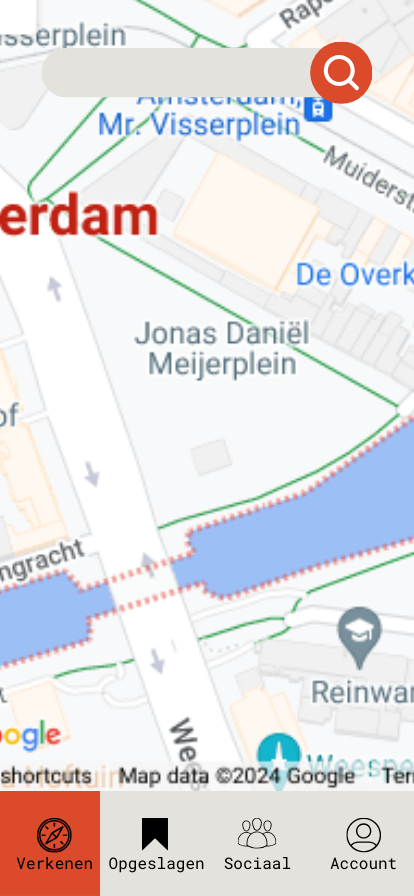
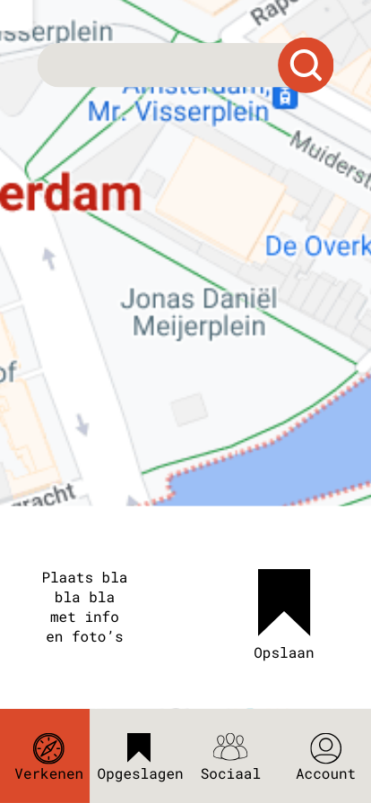
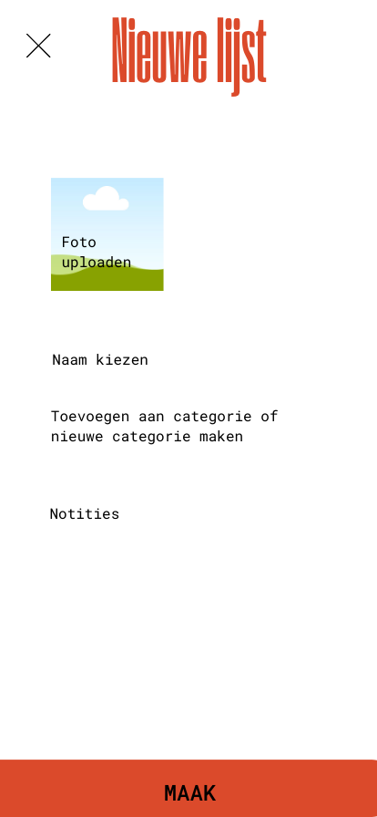

# Explore maps project
Femke Ottow

## Het probleem
Door verschillende sociale media kom je plekken tegen die je een keer wil bezoeken. Deze kan je opslaan op dat dergelijke account, of een stapje verder en het opslaan op Google Maps. Google Maps heeft de handige functionaliteit om je opgeslagen plaatsen weer te geven op de kaart. Zo kun je als je in Rome bent meteen zien welke plekken er in de buurt zitten die je hebt opgeslagen. Je kan verschillende lijsten maken voor bijvoorbeeld shops en restaurants, maar de mogelijkheden in onderscheid zijn beperkt. Ook wordt er regelmatig in whatsapp groepen gevraagd of iemand nog leuke restaurantjes weet of wat leuk is om te doen in London. Maar mijn opgeslagen plekken in Londen kan ik dan niet zo makkelijk even delen, tenzij ik een nieuwe lijst maak specifiek voor London. 

## Verwachte gebruikers
Omdat dit probleem zich afspeelt binnen mijn leeftijds categorie ga ik mij met het ontwerp ook hier op focussen. 
Deze mensen zijn tussen de 18 en 40 en vinden het leuk om op reis te gaan en mooie/leuke/interessante plekken te ontdekken. Ze zullen ook gebruik maken van onder andere Instagram en Pinterest. Daarnaast zal ik zelf ook een gebruiker zijn. 

## Setting
Mensen zullen de app gebruiken op de laptop wanneer ze een reis oid gaan plannen, maar verder wil je het eigenlijk snel kunnen gebruiken op je smartphone. 

## Niche 
Door mijn app kan je makkelijk lijsten maken op basis van geüploade data en inspiratie vinden voor als je van plan bent op pad te gaan. De app is ideaal voor jongeren die op reis graag willen weten waar ze heen kunnen, wat leuk is en waar goed eten is. Het is een combinatie van reisblogs en google maps opgeslagen locaties.  

# De oplossing 
Met mijn platform wil ik de mogelijkheid bieden om de functionaliteiten die Google Maps al bied uit te bereiden door het nog meer te personaliseren, makkelijk data te kunnen delen door een filter/selecteer functie en Data met een select functie toe te voegen aan lijsten in plaats van een voor een. 

 
 
 
 
 
 
 
 
 
 
 
 
 
 
 
 
 
 
 
 

# Features
## Need to have:
- Welkom page.
- Inlog pagina.
- Registreer pagina. 
- Een upload functie om data die je al hebt opgeslagen in google maps in te laden in je data base.
- Een mogelijkheid om data te groeperen in lijsten met een eigen bedachte naam en icoon.
- Filter/selectie functie om bepaalde data in een keer in een lijst te kunnen zetten
- Een overzicht van alle verschillende lijsten.
- De kaart met daarop de icoontjes van de opgeslagen plekken 
- Het ophalen van alle informatie van de plek uit google maps incl foto's
- Een lijst met al je data/opgeslagen locaties.
- Een check voor als je een locatie al had toegevoegd aan de lijst, dat hij er niet dubbel in komt te staan.
- Een goede zoek/select functie die je in staat stelt data te verzamelen en te delen. Bijvoorbeeld: ik heb verschillende lijsten voor Parijs en iemand vraagt om tips voor Parijs. Dan wil ik al mijn Parijs lijsten met die persoon delen
- mobiele versie 
- mogelijkheid om een emoji toe te voegen aan een categorie zodat die zo zichtbaar is op de kaart

## Nice to have:
- About page
- Contact pagina
- Mogelijkheid tot interactie met lijsten van andere gebruikers op de app
- Het delen van een geselecteerde data set zoals die van Parijs, maar dan met kopjes gesorteerd uit welke lijst het komt. Dus Vintage winkels: bla bla, la la, etc. Bakkers: la la, bla bla, etc. en dan onder elkaar. 
- Status mogelijkheden als: wil ik heen of geweest of anderen geweest etc
- Mogelijkheden om er wat bij te schrijven 
- Mogelijkheid om foto's toe te voegen aan je opgeslagen lijst. Default is de eerste letter van de titel
- voorgestelde locaties 

# Requirements
- Google maps API voor de map, coördinaten en info over locaties

# Wat wordt moeilijk?
In eerste instantie wordt het een uitdaging om de google API goed te implementeren. Verder wordt het de uitdaging om de data goed weer te geven en alle mogelijke opties op een logische wijze neer te zetten. Zo moet je kunnen filteren en met deze data ook weer acties kunnen uitvoeren. Op dit moment weet ik nog niet exact wat allemaal kan dus hier moet ik nog goed in duiken. Het wordt ook een uitdaging om alle verschillende pagina's te maken, want met de opties betekent het ook dat er veel pagina's nodig zijn. Als laatst denk ik dat het ook moeilijk gaat worden om icoontjes aan locaties op de map toe te voegen 